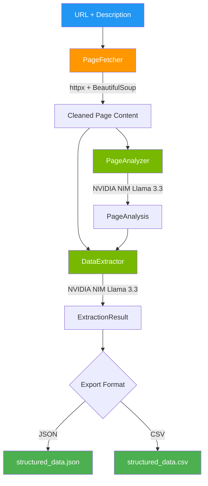
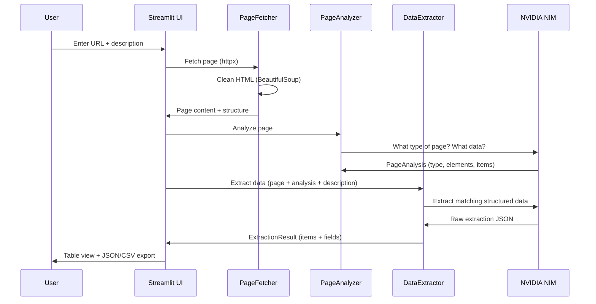

# Smart Scraper Agent

**AI-powered web scraping** — give a URL and describe what data you want in plain English. The AI analyzes the page structure, extracts structured data, and exports to **JSON or CSV**.

Built with **PydanticAI patterns**, **NVIDIA NIM (Llama 3.3 70B)**, **BeautifulSoup**, and **Streamlit**.


[](https://github.com/vsk7797/smart-scraper-agent/actions)

---

## Architecture



### Scraping Pipeline



---

## Features

- **Natural language extraction** — describe what you want in plain English
- **Page analysis** — AI identifies page type, data elements, and repeating patterns
- **Structured output** — Pydantic-validated extraction results with confidence scores
- **Multi-format export** — download as JSON or CSV
- **Preset examples** — Hacker News, Wikipedia tables, GitHub Trending
- **Multiple models** — choose Llama 3.3, Nemotron Ultra, Mistral, or DeepSeek

---

## Project Structure

```
smart-scraper-agent/
├── agents/
│   ├── __init__.py
│   ├── fetcher.py           # Web page fetcher + HTML cleaner
│   ├── analyzer.py          # AI page structure analyzer
│   └── extractor.py         # AI data extractor + JSON/CSV export
├── models/
│   ├── __init__.py
│   └── schemas.py           # Pydantic schemas (ScrapeRequest, ExtractionResult, etc.)
├── tests/
│   ├── __init__.py
│   └── test_schemas.py      # Unit tests
├── .github/
│   └── workflows/
│       └── ci.yml           # GitHub Actions CI
├── app.py                   # Streamlit frontend
├── requirements.txt
├── .env.example
├── .gitignore
└── README.md
```

---

## Quick Start

### 1. Clone & Install

```bash
git clone https://github.com/vsk7797/smart-scraper-agent.git
cd smart-scraper-agent
python -m venv .venv
.venv\Scripts\activate        # Windows
# source .venv/bin/activate   # macOS/Linux
pip install -r requirements.txt
```

### 2. Set Up API Key

```bash
cp .env.example .env
# Edit .env:
# NVIDIA_API_KEY — free from https://build.nvidia.com
```

### 3. Run

```bash
streamlit run app.py
```

### 4. Use

1. Enter your NVIDIA NIM API key in the sidebar
2. Enter a URL (or use a preset)
3. Describe what data you want to extract
4. Click **Scrape & Extract**
5. View the extracted table and download as JSON/CSV

---

## Example Use Cases

| URL | Description | Output |
|-----|-------------|--------|
| `news.ycombinator.com` | "Extract titles, URLs, points, authors" | Structured HN stories |
| `en.wikipedia.org/wiki/List_of_...` | "Extract country names and GDP values" | Table data |
| `github.com/trending` | "Extract repo names, descriptions, stars" | Trending repos |
| Any product page | "Extract product name, price, rating" | Product data |

---

## API Keys

| Key | Source | Cost |
|-----|--------|------|
| `NVIDIA_API_KEY` | [build.nvidia.com](https://build.nvidia.com) | Free tier |

---

## Running Tests

```bash
pytest tests/ -v
```

---

## License

MIT
